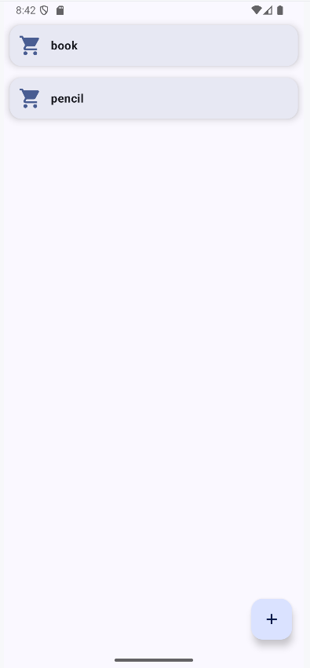
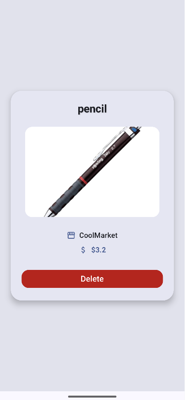
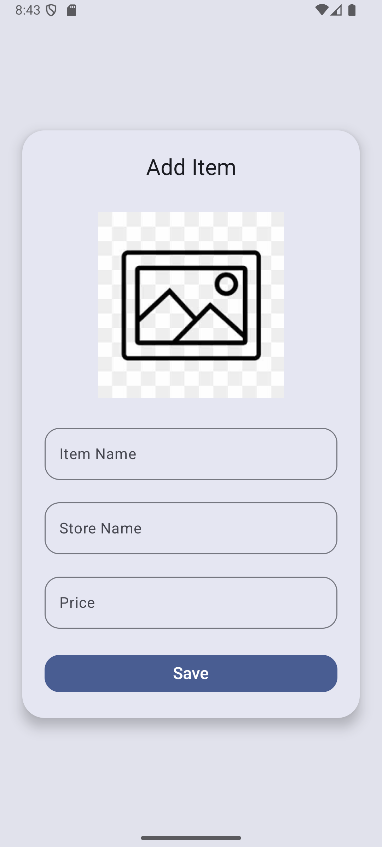

# 🛒 ShoppingNote  

ShoppingNote, kullanıcıların alışveriş ürünlerini kolayca kaydedip yönetmesine yardımcı olan basit ve kullanışlı bir **Android uygulamasıdır**.  

## 🚀 Özellikler  

- ➕ **Ürün Ekleme:**  
  Kullanıcı ürünün **adı, markası ve fiyatını** girerek yeni bir ürün ekleyebilir.  

- 📋 **Listeleme:**  
  Kaydedilen ürünler **sıralı bir şekilde** listelenir.  

- 🔍 **Detay Görüntüleme:**  
  Listeden seçilen ürünün detay bilgileri görüntülenebilir.  

- ❌ **Ürün Silme:**  
  Detay ekranında ürün silinebilir.  

## 🛠️ Kullanılan Teknolojiler  

- **Kotlin**  
- **Android Jetpack Compose** – Modern UI tasarımı  
- **Room Database** – Veritabanı işlemleri (CRUD)  
- **MVVM (Model-View-ViewModel) Mimarisi** – Temiz kod yapısı  
- **Navigation Component** – Ekranlar arası geçiş  

## 📱 Ekranlar  

- **List Screen** → Kaydedilen ürünlerin listelendiği ekran  
- **Add Item Screen** → Ürün adı, marka ve fiyat girilerek yeni ürün ekleme ekranı  
- **Detail Screen** → Ürün detaylarını görüntüleme ve silme ekranı
-

## 📸 Ekran Görüntüleri
<div align="center">





</div>


	
	
## 🎯 Gelecek Geliştirmeler

🔔 Ürün için hatırlatma ekleme

💾 Cloud senkronizasyonu (Firebase)

🖼️ Ürünlere resim ekleme


## ⚙️ Kurulum  

1. Bu projeyi klonlayın:
   ```bash
    git clone https://github.com/kullanici-adi/ShoppingNote.git

 2.  Android Studio’da açın.
 3.  Uygulamayı bir emülatör veya gerçek cihazda çalıştırın.
